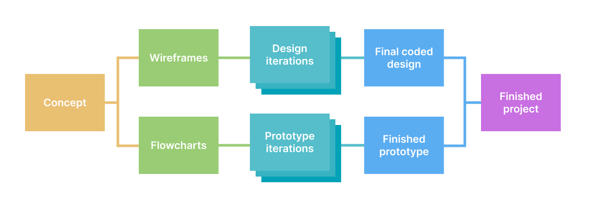

import CustomAside from '@/components/CustomAside.astro';

- DevLogs `20%`
- Git Milestones `10%`
- Javascript Proficiency `15%`
- Presentation `15%`
- Final Project `40%`

## DevLogs

<CustomAside type="info" oneline="true">A journal of your learning progress (technical and otherwise).</CustomAside>

Throughout this course you will write about and document what you learn, adding text, images, and other media to reinforce concepts from the course. Describing new materials in your own words not only increases learning, but allows you to track your progress, debug and share your design and technical solutions, and lets you refer back to this material after this semester. See the Schedule for setup and list of DevLogs, and follow these tips:

- Add text, images, videos, links to tutorials, code, examples, etc.
- Use `.md` or `.mdx` files to add rich text formatting and improve readability.
- Name the files appropriately (e.g. `devlog-2-1.mdx`) to make them easy to find.
- Update and commit your work often so we can refer to it in class. 
- Post in Moodle a direct link to the file where prompted.
- The deadlines are listed in the schedule.

{/* 
Add this to DevLogs
A follow-up comment in response to another student’s comments (if you weren’t first). */}

### 📚 Reading Responses

Use the following outline when the DevLogs ask for a reading response. Links and references should be properly cited using a style of your choice.

- A summary of the content
- 1 quote from the content
- 1 related comment on the content
- 1 related discussion question (a prompt you would like to explore in class)
- Share a related work of art, design, or technology that relates to the text(s) and reflect it is so.

## Git Milestones

<CustomAside type="info" oneline="true">A list of student competencies for Git and Github.</CustomAside>

Git and Github are essential in this class. Post a link to your finished (parts 1 and 2) [Git Milestones](https://github.com/omundy/learn-git-milestones) repo in Moodle. If you have completed these previously then you can link to your finished repo.

## Javascript Proficiency

<CustomAside type="info" oneline="true">Complete exercises and lessons to further your knowledge of JS.</CustomAside>

Javascript coding is essential in this class. Complete all Codecademy sections in the following lessons and post a screenshot showing your completion to Moodle. 

- https://www.codecademy.com/learn/introduction-to-javascript 
- https://www.codecademy.com/learn/asynchronous-javascript 
- https://www.codecademy.com/learn/learn-node-js 

{/*

## Presentation

You (and a partner) will give a short presentation and lead an activity (discussion, game, case study, etc.) related to a book chapter one day this semester. Consult the schedule and add your name on the discussion document. 

I will share more details in the 2nd class.

Instructions

1. Do the readings for this day, including any listed as optional. Then, read 2–3 additional related academic articles. Also consider films, games, art, or other cultural works. 
1. Develop a thesis or research question(s) to explore in a presentation and classroom activity / discussion prompt with the class. Your goal is not to just present the readings, but to respond to them somehow through a short class activity.
1. Prepare a Google Presentation, include information, graphics, and succinct bullet points.  Keep videos short. 
1. The presentation (:10) and interactive (:10) portion should be about 20 min total.
1. Add your synopsis and link your presentation in the discussion one week prior so I know your plan.

Potential Presentation structure (20 slides max, about 1 minute each)
1. Slides 1–3: Key questions to consider and discuss at the end of your presentation
1. Slides 4–16: Information from the readings and supporting material for your questions.
1. Slides 17–18: Summary / Repeat key points
1. Slides 19: Prompt for activity / discussion: You may lead the whole class or organize small groups that report back to the whole class. See: this list of Class Discussion Strategies or the Design Thinking Toolkit for ideas. 
1. Slide 20: List sources.

 1. A cultural item
1. A theory
1. An example that might be inspired by this concept 

- Early generative art: Sol LeWitt, [Stanley Brouwn](https://www.moma.org/artists/29982-stanley-brouwn), Georg Nees, Frieder Nake, Vera Molnár, Sonia Landy Sheridan, and [Lillian Schwartz](https://www.youtube.com/watch?v=XAlXN-F2vPQ)
- Demoscene

Students choose from a "connection" subject for a presentation+activity that explores the history, technology, people, works that lie at the intersection of one of the following (or propose one). Incorporate additional articles and research...

Demoscene + #algorave
https://ricardocabello.com/
https://www.instagram.com/p/DMOTdIXTTP8/?hl=en
https://strudel.cc/
https://tidalcycles.org/

HCI + Xerox Parc

Look at computer art history for more examples....

 */}

## Final Project 

<CustomAside type="info" oneline="true">Use tech and context(s) from the course to develop an app that breaks from software norms.</CustomAside>

Technology has always been complicated. It embodies the dreams as much as the failures of our species. It accelerates the possibility we might improve and ease the burdens of humankind, yet continues to allow us to cause harm and inequality. The tech that Facebook creates is considered innovative, not because it makes the world better, safer, or more humane, but due to its ability to capture and sell attention, manipulate populations, and generate massive wealth for a few individuals. 

Recall however, technology is not only not neutral, it is also not yet self-deterministic. The messiness of technology mirrors our own possibilities and biases. The definition of "new" has equal subjectivity. The invention of the wheel was surely a hit at its "launch party" for allowing humans unprecedented mobility. Yet, like many other innovations, it contributes towards accelerating our destruction of the natural world. 

At the outcome, you will have developed your concept, incorporating knowledge from the course to research, ideate, prototype, test, build and deploy a "thing", and importantly, describe your motivations, inspiration, process through an accompanying statement and documentation.

import IdeaGenerator from '@/components/IdeaGenerator.svelte';

### 1-Concept

*Identify a topic, collect research, prepare a summary for a brainstorming session.*

1. **Identify potential topics** to explore. It shouldn't be too specific, nor too broad. Is there a specific problem you want to solve? Or do you wish to address issues by [problematizing](https://en.wikipedia.org/wiki/Problematization) your subject?
1. **Collect research** (related articles, etc.) **and examples** (2-3 links or summaries of similar projects). See the [Critical Web Design Index](https://criticalwebdesign.github.io/index) for inspiration.
1. **Identify new skills or technologies** (e.g. a design method, programming pattern, code library, etc.) you are interested to learn and could potentially use in your project.
1. **Write a summary** of your topic(s), research, and technology (3–4 sentences). Address why you are drawn to this topic and why it is important to explore. Identify the communities, resources, and issues involved. What [frameworks](./tutorials/resources) or methodologies might you use?
1. Use an idea generator to spark a perspective you've never considered:  <IdeaGenerator client:load />
1. Bring the above to class for the...

In-class activity

In groups, brainstorm on your topic(s) use the <a href="https://omundy.github.io/project-development-template/materials/brainstorming-disney-method/index.html" target="_blank">Disney Creative Strategy</a>, which asks your group to assume different "hats" in order to ideate on concepts, solutions, and risks.

1. Everyone: post your subject or concept in Slack
1. As Dreamers, add new ideas for projects based on the subject to the posts in your group
    - How might you create something that helps others discuss, think about, or help to solve the issue?
    - The more ideas the better. Brainstorming aims to produce quantity, from which we select quality ideas.
    - No criticism. Our goal is to generate a pool of ideas. All ideas are welcome.
1. As Realists, after all have posted, talk about each in a group
    - Think more practically, about how you would put the ideas into practice.
1. After the session, explore the ideas and notes as a critic, to figure out what you can build in the given time

### 2 - Proposal

Create a pitch deck (10-15 slide **Google Presentation**)* to share and plan your project that contains:

1. A one paragraph introduction to your concept and what you plan to make. 
1. Audience - Who will use this and why? Write a [user story](https://www.atlassian.com/agile/project-management/user-stories) describing their goals.
1. An initial attempt at an [identity](https://docs.google.com/presentation/d/1exnY8fjVsOc3bKZFESJIM2s4JKxhqg_oASPDPokSfrE/edit?usp=sharing) (e.g. a logo, word mark, style guide, etc.).
1. Competition Scan - Examples (2–3) of similar works (in concept or tech) with images and links.
1. Flowcharts (2–3) showing each step users see, and another [showing how data works](https://www.google.com/search?q=a+flowchart+that+tracks+data+through+the+app&safe=off&tbm=isch) in the app
1. [Wireframes](https://www.dreamhost.com/blog/how-to-wireframe-website/) showing all the views in the interface (introduction page, forms, results page)
1. Technology - Include [pseudocode](https://en.wikipedia.org/wiki/Pseudocode) of the main logic of your project. List technologies and demos you think you will need. List the "**unknowns**"—parts of your idea that you don't know yet how to execute.
1. Does your project use data? What potential [sources](https://github.com/omundy/dig245-regenerative?tab=readme-ov-file#data-sources) will you use?

{/* 1. Milestones: List 3 milestones towards finishing this project. Explain what you will have done on each. */}

In-class activity (lightening talks)

##### <a href="https://en.wikipedia.org/wiki/Lightning_talk">Lightning talks</a> of your pitches
1. Share a link to your proposal in Slack.
1. Present slides on Zoom. 3 minutes max.
1. 1 minute max for questions / comments. Add others in Slack thread.

In-class activity (speed dating)

##### Speed Dating

1. Find a partner.
1. Share your proposal, progress, and unknowns. (3 min)
1. Your partner should ask questions and make comments while you make notes. (1 min)
1. Switch roles and repeat the above.
1. Switch partners and repeat.

### 3 - Prototype

Create a working “proof of concept” of your app.

1. Your prototype should contain the essential functions of your project.
1. Your work should be live (able to be shared via a link in Slack)
1. Feel free to fork and use any example repository from class to get started.
1. [Save and refresh](https://github.com/omundy/learn-computing/blob/main/topics-keyboard-shortcuts.md#web-development-edit-save-refresh-loop) your work in the browser often to see your changes. Commit changes regularly.

In-class activity

In groups, share your prototypes to get feedback:

- Be ready to explain the current status of your work.
- Bring specific questions or unknowns (concept, design, tech) you would like to discuss with your group.

	

### 4 - Design

Design iterations of main views.

1. The design should reflect the overall concept and goals of your project.
1. Create your design iterations with [Figma](https://figma.com), or use a Bootstrap or Tailwind template. **Show your work!** Do not delete previous versions—we want to see your progress as you iterate and improve your designs.
1. Include a [Moodboard](https://www.google.com/search?q=web+design+moodboard) showing your research into how others have designed solutions to similar information and design problems
1. Create multiple iterations of each different page / view your app.
1. Look at relevant examples of good design to help you improve your own, then experiment and iterate! See DIG 245 [presentations](https://docs.google.com/presentation/d/1BiIHVEQjmIb2k2vB6N3x1g_S3KSLyZq2YCniq1ONjg8/edit?usp=sharing) for more. 
1. **Do not use AI-generated logos, icons, images, etc.** An important part of a design practice includes creating the ideas for these things and producing them yourself. At the very least, consider using royalty free images created by actual humans from [thenounproject.com](https://thenounproject.com/) or  [unsplash.com](https://unsplash.com/) instead of using whatever AI barfs up.

In-class activity

Share your iterations to get feedback before coding the final design.

- Bring to class: What are three questions you would like to ask each user of your potential design?
- In-class: [Design Critique: Imaginary Audience](https://docs.google.com/presentation/d/1BiIHVEQjmIb2k2vB6N3x1g_S3KSLyZq2YCniq1ONjg8/edit#slide=id.gf16dac508b_0_0)

### 5 - Design + Prototype

1. Combine your coded design and prototype
1. Your project should be 95% complete

In-class activity

1. Make sure your project is live and ready to share. Post a link to it and Figma in Slack.
1. Share your project in a small group (watch other use it, get specific feedback)
1. Then, we'll go around the room and those who wish can share with the whole class in a <a href="https://en.wikipedia.org/wiki/Lightning_talk">lightning talks</a> (3 min.) format.

### 6 - Deliverables

Your finished project should include:

1. **The Project**
	1. Your coded design (valid [HTML](https://validator.w3.org/) and [CSS](https://jigsaw.w3.org/css-validator/) ([?](https://github.com/omundy/dig245-critical-web-design/blob/main/topics/html-css/css.md#css-validation))) combined with your prototype in a final application.
	1. About page: A well-designed, but simple page that contextualizes your project. It could appear as an introduction to the project or provided at the end to explain what happened.
	1. The project should be live, hosted on Github Pages, Davidson Domains, or [some other server](https://github.com/omundy/learn-javascript/blob/main/topics/servers/servers.md).
1. **Documentation**
	1. A Google Presentation (update your original proposal with screenshots, text, flowcharts, etc.) to document and share your finished project.
	1. A screencast video taken on your computer (do not use a cell phone!) (1:30 max) to demonstrate how your project works (see [tips](https://omundy.github.io/learn-computing/slides/documentation.html))
	1. A 200–300 word statement explaining your concept and execution. This can be posted in Moodle, or included somehow in the actual project (e.g. the Intro page).
	1. A link to (all of) your Figma layouts
1. **Moodle Post**
	1. When finished, push, publish, and post all deliverables to Moodle per documentation in the Assignments.

{/* 

## Recreate an existing work

Prompt 8.3 Add New Data to Your Project

It’s impressive how using variables and functions keeps the code modular, which organizes it and makes the code easy to build on. What would Jean Arp think? Now that you have a handle on using loops, arrays, and SVGs to create a generative work, continue to experiment with the interface, parameters, and concepts of your project as you create a generative browser experience inspired by the history of art and interactivity. Think about replayability as you do to encourage users to return to and play with your work as they experience new outcomes.

Here are some potential components you could include in your idea and execution:

1. **Randomness/chance** — Consider reflecting on the tension between decisions/definitions created by the artist/author and the elements that are left to randomization/chance.
2. **Color generation** — Will color information be purely random, or influenced by other factors like time, interactivity, or other data?
3. **Composition and form** — What rules will you use in creating and positioning objects?
4. **Sound/multimedia** — How might sound or other media add to your ideas?
5. **Rules** — How will decisions you make be informed by the work you are inspired by? How might you put your project in conversation with art history? Think also about the discussion of fair use, notably with respect to the notion of transformation, in chapter 2.
6. **Customization(s)** — What interactivity might you add to allow the viewer to appreciate,  modify, or play with the work? How might you encourage replayability as users return or revisit the page? 

Regardless of your approach, your project should mimic or somehow find inspiration in these processes to reflect your own thinking on the subject.
 */}

